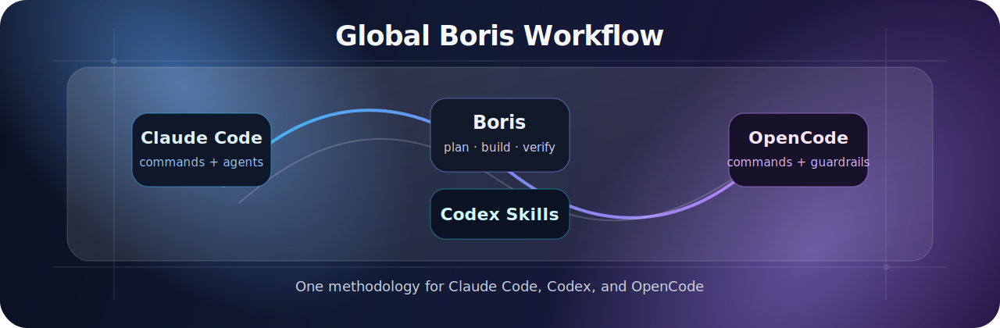

<p align="center">
  
</p>

<h1 align="center">Global Boris Workflow</h1>

<p align="center">
  A portable, safety-first workflow for <strong>Claude Code</strong>, <strong>Codex</strong>, and <strong>OpenCode</strong>.
</p>

<p align="center">
  <a href="USER-GUIDE.md"><strong>User Guide</strong></a>
  ·
  <a href="GUIA-USO.md"><strong>Guía en español</strong></a>
  ·
  <a href="AGENT-INSTALL.md"><strong>Agent Install Guide</strong></a>
</p>

<p align="center">
  
  
  
  
</p>

<p align="center">
  <a href="USER-GUIDE.md"></a>
  <a href="GUIA-USO.md"></a>
</p>

<table>
  <tr>
    <td><strong>New to AI coding workflows?</strong><br />Start with the guide before installing anything. It explains the terms, the safe workflow, when to plan, when to verify, and how to avoid losing context or overwriting work.</td>
    <td><strong>Recommended path</strong><br /><a href="USER-GUIDE.md">Read the User Guide</a><br /><a href="GUIA-USO.md">Leer la guía en español</a><br /><a href="AGENT-INSTALL.md">Then install with an agent</a></td>
  </tr>
</table>

---

## What This Is

This repo packages a global development workflow inspired by Boris Cherny's Claude Code methodology and adapts it to three local AI coding tools:

- **Claude Code**: global `CLAUDE.md`, agents, and slash commands.
- **Codex**: global `AGENTS.md`, custom agents, skills, and command safety rules.
- **OpenCode**: global `AGENTS.md`, agents, commands, and conservative permissions.

The goal is not to install more tooling for the sake of it. The goal is to make every tool follow the same operating rhythm:

1. Understand the goal.
2. Plan before editing when the task is non-trivial.
3. Make the smallest correct change.
4. Verify with the relevant checks.
5. Close with a clear status and next step.

## Why Use It

- **One workflow across tools**: Claude Code commands, Codex skills, and OpenCode commands map to the same routines.
- **Safer defaults**: commits, pushes, destructive shell commands, and external actions require explicit intent.
- **Reusable agents**: planning, architecture, and simplification are handled by focused assistants.
- **Portable setup**: install everything or only the tool you use.
- **Team-friendly docs**: non-expert users can start with the practical guides.

## Quick Install

Install everything:

```bash
curl -fsSL https://raw.githubusercontent.com/W4k4s/claude-code-boris-workflow/main/install.sh | bash
```

Install one tool only:

```bash
curl -fsSL https://raw.githubusercontent.com/W4k4s/claude-code-boris-workflow/main/install.sh | bash -s -- --claude
curl -fsSL https://raw.githubusercontent.com/W4k4s/claude-code-boris-workflow/main/install.sh | bash -s -- --codex
curl -fsSL https://raw.githubusercontent.com/W4k4s/claude-code-boris-workflow/main/install.sh | bash -s -- --opencode
```

Available installer options:

```bash
./install.sh --all
./install.sh --claude
./install.sh --codex
./install.sh --opencode
```

Test a local checkout without cloning `main` from GitHub:

```bash
BORIS_WORKFLOW_SRC="$PWD" ./install.sh --all
```

The installer only copies global workflow files. If a destination file already exists and differs, it shows a diff and asks whether to overwrite, skip, or back up and overwrite.

## Agentic Install Prompt

Open Claude Code, Codex, or OpenCode in any directory and paste:

```text
Read https://github.com/W4k4s/claude-code-boris-workflow - especially AGENT-INSTALL.md - and install the Boris workflow for the tools I specify.
If I do not specify a tool, install all of them: Claude Code, Codex, and OpenCode.
If I already have files with the same name under ~/.claude, ~/.codex, ~/.agents/skills, or ~/.config/opencode, show me the diff before overwriting.
Do not touch project-specific files, credentials, plugins, or settings that are not covered by the installer.
At the end, summarize what you installed and what you left untouched.
```

## What Gets Installed

| Tool | Global instructions | Agents | Workflows | Guardrails |
| --- | --- | --- | --- | --- |
| Claude Code | `~/.claude/CLAUDE.md` | `~/.claude/agents/*.md` | `~/.claude/commands/*.md` | Existing Claude permission flow |
| Codex | `~/.codex/AGENTS.md` | `~/.codex/agents/*.toml` | `~/.agents/skills/boris-*` | `~/.codex/rules/boris-safety.rules` |
| OpenCode | `~/.config/opencode/AGENTS.md` | `~/.config/opencode/agents/*.md` | `~/.config/opencode/commands/*.md` | `~/.config/opencode/opencode.json` |

## Workflow Parity

| Workflow | Claude Code | Codex | OpenCode |
| --- | --- | --- | --- |
| Adversarial review | `/grill` | `$boris-grill` | `/grill` |
| Review local changes | `/review-changes` | `$boris-review-changes` | `/review-changes` |
| Quick commit | `/quick-commit` | `$boris-quick-commit` | `/quick-commit` |
| Commit + push + PR | `/commit-push-pr` | `$boris-commit-push-pr` | `/commit-push-pr` |
| Tech debt cleanup | `/techdebt` | `$boris-techdebt` | `/techdebt` |
| Parallel worktree | `/worktree` | `$boris-worktree` | `/worktree` |
| Session close | `/cierre-sesion` | `$boris-cierre-sesion` | `/cierre-sesion` |

## Directory Layout

```text
global/
├── CLAUDE.md
├── agents/
├── commands/
├── codex/
│   ├── AGENTS.md
│   ├── agents/
│   ├── rules/
│   └── skills/
└── opencode/
    ├── AGENTS.md
    ├── opencode.json
    ├── agents/
    └── commands/
```

## Safety Guardrails

The workflow is intentionally conservative:

- It never overwrites global instruction files silently.
- It avoids project-specific files, credentials, auth files, histories, caches, sessions, and logs.
- Codex rules require confirmation for force-push, hard reset, `git clean`, and recursive `rm`.
- OpenCode permissions ask before edits, bash, and external directory access; `git push --force*` is denied.
- Commit and PR flows require explicit user intent.

## Documentation

- [User Guide](USER-GUIDE.md): practical guide for users, including glossary, examples, prompts, and safe workflows.
- [Guía de buen uso](GUIA-USO.md): Spanish version of the user guide.
- [AGENT-INSTALL](AGENT-INSTALL.md): installation instructions for AI agents.

## After Installation

1. Fill in your profile in the installed global instructions for the tools you use.
2. Run a simple planning workflow to confirm the tool sees the instructions.
3. Add learned cross-project rules when an assistant makes a repeatable mistake.

## License

MIT.
